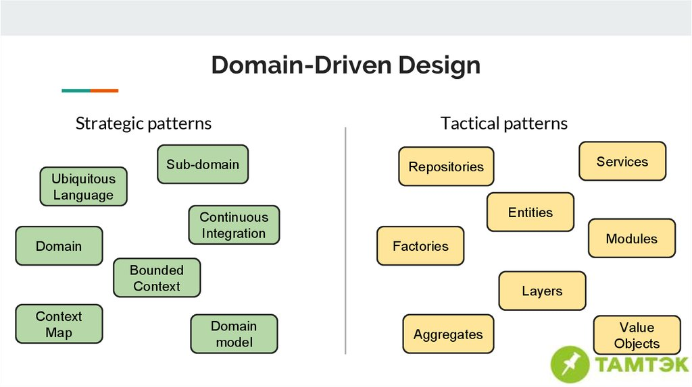

= Domain Driven Design
:source-highlighter: highlightjs
:revealjs_theme: white
:revealjs_history: true
:revealjs_plugin_pdf: enabled
:revealjs_plugin_highlight: enabled
:revealjs_progress: true
:customcss: custom.css
:data-uri:
:icons: font

== The Blue Book 

[quote]
====
Tackling Complexity in the Heart of Software
====
Eric Evans, 2003

image::images/blue-book.png[]

== DDD Quickly

image::images/DDDViteFait.png[]

https://www.infoq.com/fr/minibooks/domain-driven-design-quickly

== What's DDD ?

* 👥 Domain model oriented approach from the domain expert inputs
* 🛠 Toolbox of tactical and strategic patterns
* 🔫 Not a silver bullet

== DDD vs CRUD

image::images/twitter-cyriux.png[]

== Why DDD ?

* 🤝 Better understand and communicate with your business experts
* 🤯 Decrease accidental complexity to focus on business complexity
* 😎 Master the complexity and improve maintenability
* ✂️ Separate code that changes frequently from code that is stable

== Complexity

image::images/complexity.png[]

https://www.lilobase.me/certaines-complexites-sont-plus-utiles-que-dautres/

== Strategic & Tactical patterns

== Ubiquitous Language

TODO

== Domain model

* Entity
* Value Object

== Entity

TODO

== Value Object

TODO

== Aggregate

TODO

== Aggregates

image::images/aggregates.png[]

== Repository

TODO

== Layered Architecture

[quote]
====
Hexagonal Architecture - Ports & Adapters
====
Alistair Cockburn

image::images/ddd-hexagonal.png[]

== Hexagonal dependencies

image::images/hexagonal.png[]

== Scaling DDD - Bounded Context

image::images/bounded-context.png[]

== DDD at Alan?

TODO
