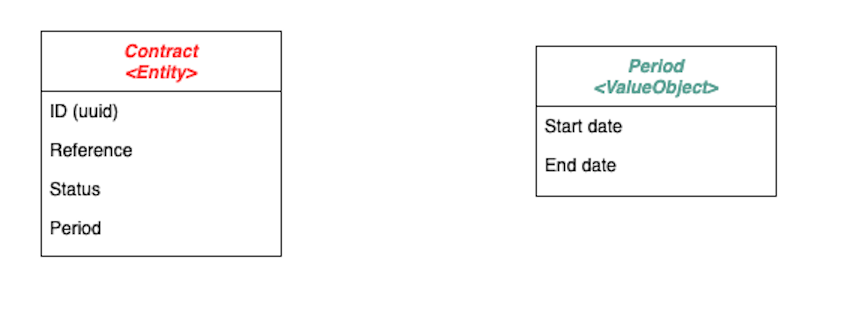
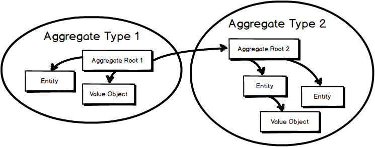

= Domain Driven Design 
:source-highlighter: highlightjs
:revealjs_theme: white
:revealjs_history: true
:revealjs_plugin_pdf: enabled
:revealjs_plugin_highlight: enabled
:revealjs_progress: true
:customcss: custom.css
:data-uri:
:icons: font
💚 Alan Tech Talk #23 💚

== The Blue Book 

[quote]
====
Tackling Complexity in the Heart of Software
====
Eric Evans, 2003

image::images/blue-book.png[]

== DDD Quickly

😅 ~100 pages vs 560 pages
https://www.infoq.com/fr/minibooks/domain-driven-design-quickly

== What's DDD ?

* 👥 Domain model oriented approach from the domain expert inputs
* 🛠 Toolbox of tactical and strategic patterns
* 🔫 Not a silver bullet

== DDD vs CRUD

image::images/twitter-cyriux.png[]

== Why DDD ?

* 🤝 Better understand and communicate with your business experts
* 🤯 Decrease accidental complexity to focus on business complexity
* 😎 Master the complexity and improve maintenability
* ✂️ Separate code that changes frequently from code that is stable

== Complexity

https://www.lilobase.me/certaines-complexites-sont-plus-utiles-que-dautres/

image::images/complexity.png[]

== Strategic & Tactical patterns

== Ubiquitous Language

* 🤝 Build a common and rigorous language between developers and business experts
* 🥸 As the team better understands their business, it could evolve 
* 😇 You should align your code naming (class, variables, ...) with the ubiquitous Language

== Domain model

* 🤯 The `domain` is the problem 
* 😎 The `model` is the solution
* ❌ Not a database model, not a UML model
* 📚 Object oriented model based on `Entity`, `ValueObject` and `Aggregate`

== Entity

* Is an object defined by its identity
* Has a lifecycle (created, updated, deleted)
* Has attributes that change over time

== Entity - Example

Let's define a `Contract`

== Value Object

* Is an object with no identity
* Is defined by its immutable attributes
* Can be shared between identities
* 🤫 It's an immutable dataclass

== Value Object - Example

Let's introduce a `Period` and use it in `Contract`

== Entity vs Value Object

== Aggregate

* Is a cluster of domain objects that can be treated as a **single unit** (= same transaction)
* Has one root entity
* All references from other aggregates should reference the root, not the sub entities.

== Aggregates

== Value Aggregates - Example 1

== Value Aggregates - Example 2

image::images/aggregate_2.png[]

== Repository

* Represents a persistent collection of entities
* One repository per root aggregate
* Is **not** a DAO (Data Access Object)

== Repository - Example

[source, python]
----
class Companies:
    def get_company(company_id) -> Optional[Company]:
        pass
   
    def add_company(company) -> uuid:
        pass

    def remove_company(company_id):
        pass
----

== Show me some code

.One Aggregate
[source, python]
----
def add_contract_to_company(
        company_id, reference, start_date) -> Contract:
    company = companies.get_company(company_id)
    contract = company.add_contract(reference, start_date)
    return contract
----

.Two Aggregates
[source, python]
----
def create_contract(
        company_id, reference, start_date) -> Contract:
    contract = Contract(company_id, reference, start_date)
    contracts.add_contract(contract)
    return contract
----

== Scaling DDD - https://github.com/alan-eu/Topics/issues/15430[#15430]

image::images/bounded-context.png[]

== DDD & Architecture

== Hexagonal Architecture

Alistair Cockburn, 2005
  
image::images/ddd-hexagonal.png[]

== Hexagonal dependencies

image::images/hexagonal.png[]

== I can talk DDD for hours...🤣

* 🗣 Ubiquitous Langage
* 👨‍🏫 Domain Model: `Entity`, `Value Object` organized by `Aggregates`
* 🧳 `Repository` to handle collection of root `Aggregates`
* ⬢ `Hexagonal architecture` to isolate domain model from technical stuff

== Alan & DDD

🍿 DDD and https://github.com/alan-eu/Topics/discussions/13280[#13280] - Moving towards a product# architecture 

❓ Do you think we can use some DDD patterns for Alan codebase? 